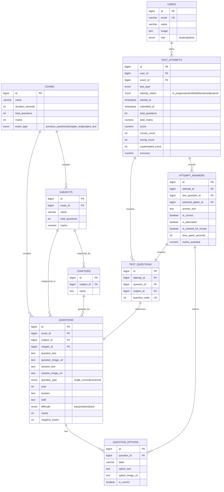

# PYQVerse

> A full-stack competitive exam mock test platform with Previous Year Questions (PYQs), timed mock tests, performance analytics, and an exam-like practice experience.

## Overview

PYQVerse is designed for **JEE Main preparation** with a scalable architecture built to support multiple competitive exams (NEET, GATE, CUET, SSC, UPSC). It provides an authentic exam experience using real previous year questions, comprehensive analytics, and interactive tools for mastering competitive exams.

---

## ✨ Features

### Test Experience
- JEE Main Previous Year Question (PYQ) mock tests
- Exam-style test interface with authentic UX
- Timed test attempts with countdown timer
- Question palette navigation for quick access
- Mark for review functionality
- Previous / Next question navigation

### Question Handling
- Image-based question and option rendering
- Solution with images and text
- Mathematical notation rendering using KaTeX
- Support for single correct and numerical questions
- Difficulty classification (Easy, Medium, Hard)

### Performance & Analytics
- Real-time score calculation
- Attempt history and comparison
- Accuracy metrics
- Subject-wise performance breakdown
- Time analysis per question

### User Experience
- Responsive design for desktop and mobile
- Intuitive test interface
- Clean UI with Tailwind CSS 4
- Scalable architecture for future expansion

### Supported Exams
- **Current:** JEE Main
- **Planned:** NEET, GATE, CUET, SSC, UPSC

---

## 🚀 Quick Start

### Prerequisites
- Node.js 18+
- PostgreSQL 14+
- npm/yarn/pnpm/bun

### Setup & Run
```bash
# Install dependencies
npm install

# Setup environment variables (copy .env.example to .env.local)
# Configure DATABASE_URL and other secrets

# Run migrations
npm run db:push

# Start development server
npm run dev
```

Open [http://localhost:3000](http://localhost:3000) in your browser.

---

## 🛠 Tech Stack

| Layer | Technology |
|-------|-----------|
| **Frontend** | Next.js 16 (App Router), React 19, TypeScript, Tailwind CSS 4 |
| **Backend** | Next.js Route Handlers, Node.js |
| **Database** | PostgreSQL with Drizzle ORM |
| **Media** | Cloudinary (images) |
| **Math Rendering** | KaTeX + react-katex |
| **Development** | ESLint, Drizzle Kit, dotenv |

### Architecture

```mermaid
flowchart LR
    UI["Next.js UI<br/>(App Router)"]
    API["Route Handlers<br/>(app/api)"]
    DB[("PostgreSQL<br/>(Drizzle ORM)")]
    CDN["Cloudinary<br/>(Media)"]
    
    UI -->|HTTP| API
    API -->|SQL| DB
    UI -->|Fetch| CDN
    API -->|Upload| CDN
    
    style UI fill:#000
    style API fill:#0ea
    style DB fill:#336
    style CDN fill:#44f
```



---

## 📁 Project Structure

```mermaid
flowchart TB
    ROOT["cbt-based-exam-app/"]
    
    APP["app/"]
    API["app/api/"]
    PAGES["app/pages/"]
    COMPONENTS["components/"]
    DB_LAYER["db/"]
    MIGRATIONS["drizzle/"]
    LIB["lib/"]
    PUBLIC["public/"]
    TYPES["types/"]
    CONFIG["config files"]
    
    ROOT --> APP
    APP --> API
    APP --> PAGES
    ROOT --> COMPONENTS
    ROOT --> DB_LAYER
    ROOT --> MIGRATIONS
    ROOT --> LIB
    ROOT --> PUBLIC
    ROOT --> TYPES
    ROOT --> CONFIG
    
    PAGES --> "page.tsx<br/>tests-list, test-attempt<br/>results, general-instructions"
    API --> "attempt, exam, submit-attempt<br/>user management"
    COMPONENTS --> "question-renderer.tsx<br/>UI components"
    DB_LAYER --> "schema.ts (Drizzle)"
    MIGRATIONS --> "migration files"
    LIB --> "cloudinary.ts, db.ts"
    CONFIG --> "next.config.ts<br/>drizzle.config.ts<br/>tsconfig.json"
```

---

## 🗄 Database Design

The database follows an entity-relationship model optimized for exam management and attempt tracking:



### Key Design Principles

- **Separation of Concerns:** Questions are stored globally; test-specific questions are frozen in `TEST_QUESTIONS`
- **Answer Tracking:** `ATTEMPT_ANSWERS` records user responses with metadata (time, correctness, marks)
- **Scalability:** Exam structure (exam → subjects → chapters) supports multiple exam types
- **Indexing:** Strategic indexes on foreign keys and frequently queried columns for performance

